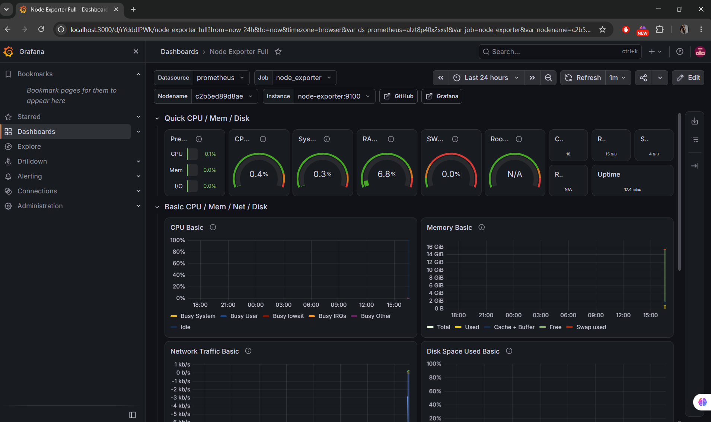

# sistem-monitorizare-devops
Hei! 

 Am construit acest proiect pentru că îmi doresc să mă dezvolt pe partea de DevOps și am vrut să înțeleg practic cum funcționează containerizarea și monitorizarea unui sistem.

 În esență, este un "stack" de monitorizare care îmi citește în timp real resursele hardware ale calculatorului (cât procesor folosesc, memoria RAM ocupată, traficul de rețea) și le afișează într-un dashboard vizual.

Ce am folosit pentru a-l construi:

-Docker & Docker compose : Pentru a rula toate aplicatiile rapid , in containere isolate, direct de pe un fisier de configurare (.yml)

-Prometheus : Baza de date care colecteaza si stocheaza metricile la intervale regulate de timp

-Node Exporter : Un agent mic care extrage informatiile fizice (hardware) ale calculatorului meu si le trimite catre Prometheus

-Grafana : Partea vizuala a proiectului , aici an interogat sursa de date si am importat un dash board pentru a transforma datele brute in grafice usor de citit si inteles.


Cum il poti rula si tu?

1. Asigura-te ca ai Docker instalat si pornit in sistemul tau
2. Deschide un terminal nou in acest folder si ruleaza comanda:
3. ```bash
  docker compose up -d
4. Intra in browser pe adresa "http://localhost:3000" si foloseste datele de logare ("admin" ; "admin")

Previzualizare Dashboard:
(dashboard(1).png)


